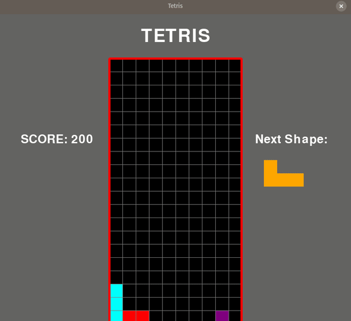

# Tetris_AI

# Tetris_AI

This project aims at playing the game of Tetris using a Genetic Algorithm. The goal is to develop an AI agent that can effectively play Tetris by making use of the advantages humans have over computers, such as the ability to view the next piece and make better decisions based on that information.

## Game  -

### Files in the Repository -
The files in the repository are: 
